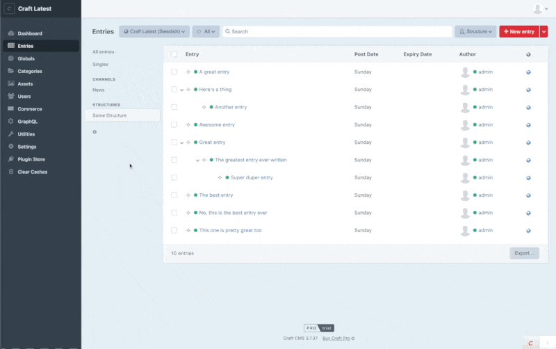

# Child Me! plugin for Craft CMS

Child Me! adds an "Add child" element index attribute to structure indexes (entries and categories are supported). Adding this attribute to an index, renders a button that works as a "shortcut" to create new child
elements nested under a particular parent – making it much easier to add a child element to a particular parent.  

For structure sections with multiple entry types, the Child Me! button displays a menu, giving authors quick access to create a child entry using a particular entry type, as well.



## Requirements

This plugin requires Craft CMS 3.7.0+ or 4.0.0-beta.3+.

## Installation

To install the plugin, follow these instructions.

1. Open your terminal and go to your Craft project:

        cd /path/to/project

2. Then tell Composer to load the plugin:

        composer require mmikkel/child-me

3. In the Control Panel, go to Settings → Plugins and click the “Install” button for Child Me!.

## Using Child Me!

To actually use Child Me!, you'll need to add the "Add child" element index attribute manually, using the CEI (
Customizable Element Index) feature available in entry and category element indexes:

Simply click the little cogwheel below your element sources in the left-side panel, check the "Add child" attribute,
drag it to the position you want and hit "Save" (see screenshot for reference).

### Events

`EVENT_DEFINE_ENTRY_TYPES`

Child Me! triggers an event when creating entry type menus, giving plugins and modules a chance to modify the available
entry types via the "Add child" button, for sections with multiple entry types. Example:

```php
\yii\base\Event::on(
    \mmikkel\childme\ChildMe::class,
    \mmikkel\childme\ChildMe::EVENT_DEFINE_ENTRY_TYPES,
    static function (\mmikkel\childme\events\DefineEntryTypesEvent $event) {
       // Only care about entries in the "Some Structure" section
       if ($event->section !== 'someStructure') {
           return;
       }
       // Make sure that the default entry type is not included
       $event->entryTypes = \array_filter($event->entryTypes, function (EntryType $entryType) {
           return $entryType->handle !== 'default';
       });
    }
);
```

## Disclaimer

This plugin is provided free of charge and you can do whatever you want with it. Child Me is _very_ unlikely to mess up
your stuff, but just to be clear: the author is not responsible for data loss or any other problems resulting from the
use of this plugin.

Please report any bugs, feature requests or other issues [here](https://github.com/mmikkel/ChildMe-Craft/issues). Note
that this is a hobby project and no promises are made regarding response time, feature implementations or bug fixes.

Plugin icon: Baby by Chintuza from [the Noun Project](https://thenounproject.com/icon/baby-3214276/)


