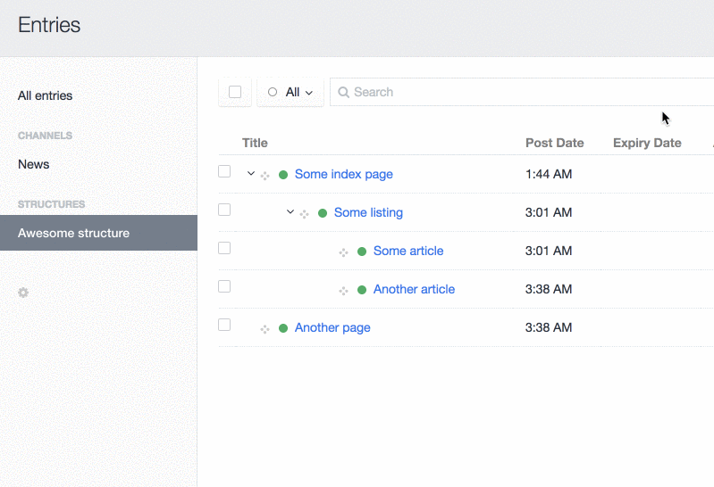

# Child Me! plugin for Craft CMS 3.x

Structures and nested Category groups are cool, but for new child elements, it's arguably less than super-intuitive to have to select the parent entry (or category) manually inside the editing page.     

Child Me! adds a nifty attribute to Structure and Category indexes, that works as a "shortcut" to create new child elements nested under a particular parent.  

As a bonus, if your Structure has more than one Entry Type, you'll get a friendly dropdown menu for pre-selecting the Entry Type that the child entry should use.    

## Requirements

This plugin requires Craft CMS 3.0.0-beta.23 or later.

## Installation

To install the plugin, follow these instructions.

1. Open your terminal and go to your Craft project:

        cd /path/to/project

2. Then tell Composer to load the plugin:

        composer require mmikkel/child-me

3. In the Control Panel, go to Settings → Plugins and click the “Install” button for Child Me!.

## Using Child Me!

To actually use Child Me!, you'll need to add the "Add child" element index attribute manually, using the CEI (Customizable Element Index) feature available in entry and category element indexes:  

Simply click the little cogwheel below your element sources in the left-side panel, check the "Add child" attribute, drag it to the position you want and hit "Save" (see screenshot for reference).    

## Disclaimer

This plugin is provided free of charge and you can do whatever you want with it. Child Me is _very_ unlikely to mess up your stuff, but just to be clear: the author is not responsible for data loss or any other problems resulting from the use of this plugin.

Please report any bugs, feature requests or other issues [here](https://github.com/mmikkel/ChildMe-Craft/issues). Note that this is a hobby project and no promises are made regarding response time, feature implementations or bug fixes.

Plugin icon: Baby by Chintuza from [the Noun Project](https://thenounproject.com/icon/baby-3214276/)

