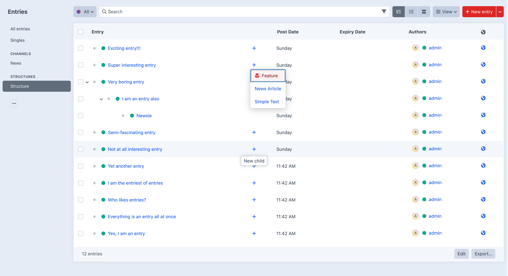

# Child Me! plugin for Craft CMS

Child Me! improves Craft's CX (child-creating experience) by making a nifty "New child" element index attribute available to element indexes.  

Adding the "New child" attribute to a structure section or category index renders a button, which works as a "shortcut" for creating new child
elements nested under a particular parent – much faster than manually selecting the parent in the "Parent" field on element edit pages!  

For structure sections with multiple entry types available, the Child Me! button opens a disclosure menu with shortcuts for creating child entries using these types.    



## Requirements

This plugin requires Craft CMS 5.0+

## Using Child Me!

Child Me! works by adding the "New child" element index attribute to a structure section or category index.  

To add the attribute, click the "Customize sources" disclosure menu toggle below your element sources in the left-side panel, then select the appropriate section and finally check the "New child" attribute.


### Events

`EVENT_DEFINE_ENTRY_TYPES`

Child Me! triggers an event when creating entry type menus, giving plugins and modules a chance to modify the available
entry types via the "New child" button, for sections with multiple entry types. Example:

```php
\yii\base\Event::on(
    \mmikkel\childme\ChildMe::class,
    \mmikkel\childme\ChildMe::EVENT_DEFINE_ENTRY_TYPES,
    static function (\mmikkel\childme\events\DefineEntryTypesEvent $event) {
       // Only care about entries in the "Some Structure" section
       if ($event->section !== 'someStructure') {
           return;
       }
       // Make sure that the default entry type is not included
       $event->entryTypes = \array_filter($event->entryTypes, function (EntryType $entryType) {
           return $entryType->handle !== 'default';
       });
    }
);
```

## Disclaimer

Please report any bugs or other issues [here](https://github.com/mmikkel/ChildMe-Craft/issues).  

Plugin icon: Baby by Chintuza from [the Noun Project](https://thenounproject.com/icon/baby-3214276/)  


